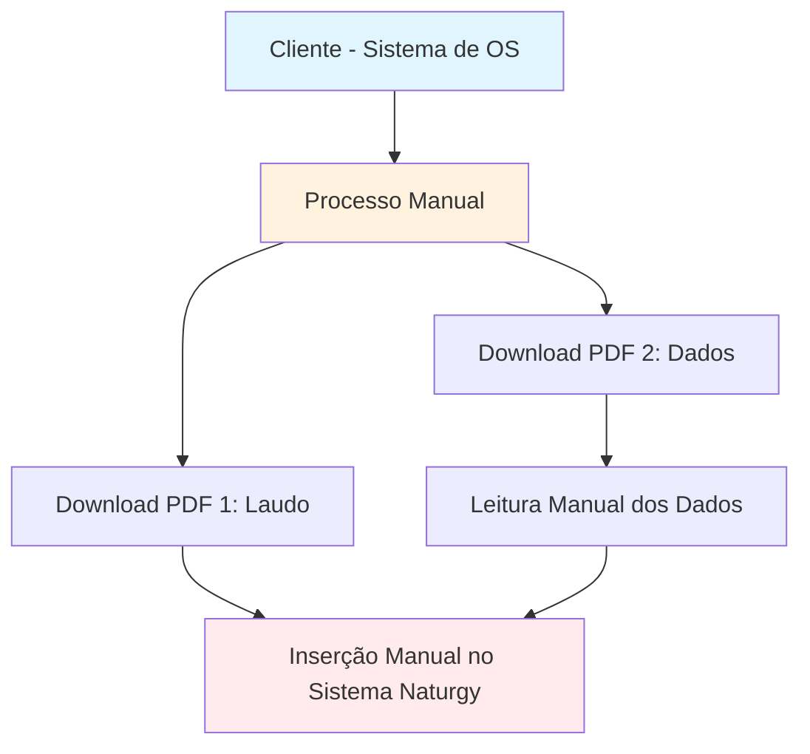
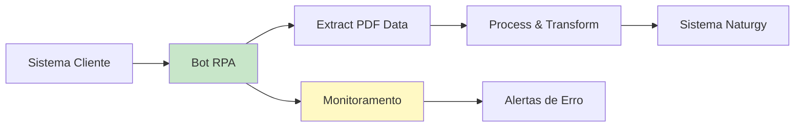
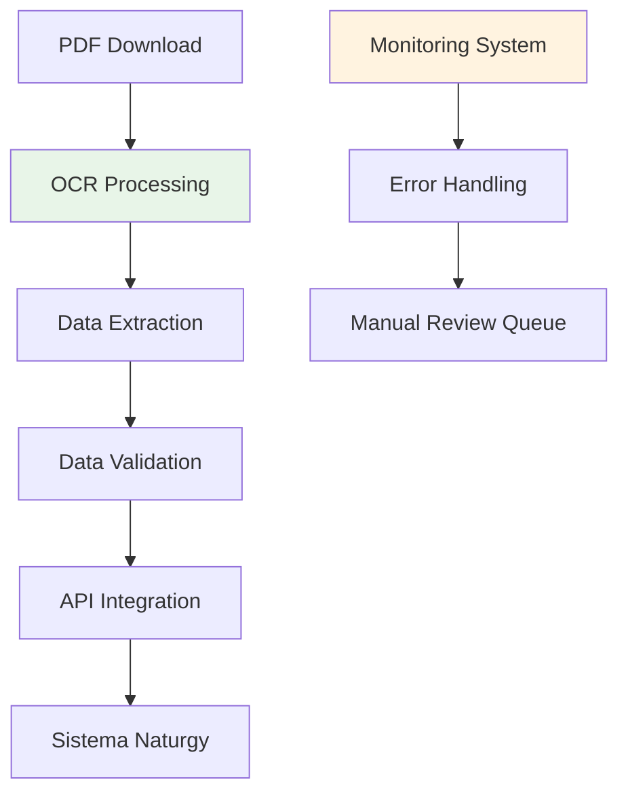
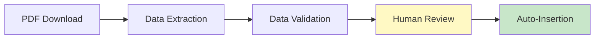
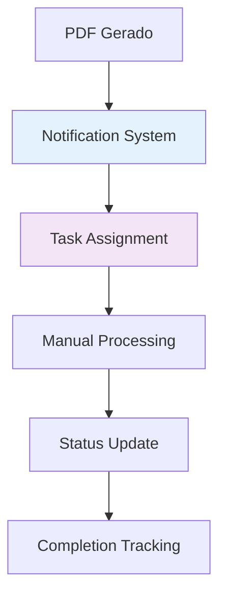
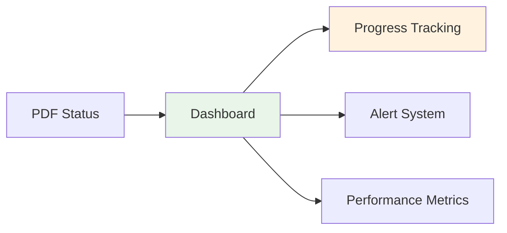

# Análise de Projeto: Automação de Extração de Dados
## Sistema de Ordem de Serviço → Sistema Naturgy

---

## 📋 Resumo Executivo

Este documento apresenta a análise técnica para automação de extração de dados entre dois sistemas:
- **Sistema Fonte**: Sistema de Ordem de Serviço (cliente)
- **Sistema Destino**: Sistema Naturgy (companhia de gás)

### Objetivo
Automatizar o processo de transferência de dados de inspeções, fiscalizações e validações de estruturas de gás do sistema do cliente para o sistema da Naturgy.

---

## 🏗️ Arquitetura Atual

### Fluxo Atual
1. Cliente executa inspeções/fiscalizações
2. Sistema gera dois PDFs
3. **Processo manual** de download e interpretação
4. Inserção manual no sistema Naturgy
5. **Sem workflow ou sinalização de mudança de status**

---

## 🔍 Análise Técnica

### ✅ **Pontos Positivos**
- Dados estruturados em PDFs
- Processo repetitivo e padronizado
- Volume de trabalho justifica automação

### ❌ **Pontos Críticos**
- **Sistema web sem APIs**: Sem endpoints para integração direta
- **Sem webhooks**: Não há notificações automáticas de mudanças
- **PDFs como única fonte**: Formato não estruturado para processamento
- **Dependência de interface web**: Mudanças na UI quebram automação

---

## 🚀 Soluções Técnicas Propostas

### Opção 1: Automação com RPA (Robotic Process Automation)

**Ferramentas Recomendadas:**
- **Playwright** (recomendado)
- **Cypress**
- **Selenium**
- **UiPath** (solução empresarial)

#### Vantagens:
- ✅ Implementação rápida
- ✅ Não requer mudanças nos sistemas existentes
- ✅ Pode lidar com mudanças de interface

#### Desvantagens:
- ❌ Fragilidade a mudanças de UI
- ❌ Manutenção constante necessária
- ❌ Possíveis falhas de automação

### Opção 2: Arquitetura Híbrida com OCR

**Componentes:**
- **OCR Engine**: Tesseract, AWS Textract
- **Data Processing**: Python, Node.js
- **Validation**: Regras de negócio customizadas
- **Monitoring**: Logs e alertas

---

## 🎯 Recomendação Principal

### **NÃO RECOMENDAMOS** a implementação de automação completa pelos seguintes motivos:

1. **Alto Risco Técnico**
   - Dependência de interface web instável
   - Possíveis mudanças nos sistemas sem aviso

2. **Custo de Manutenção**
   - Necessidade de monitoramento 24/7
   - Ajustes frequentes na automação

3. **Confiabilidade**
   - Falhas podem passar despercebidas
   - Impacto direto no processo de negócio

---

## 💡 Alternativas Recomendadas

### 1. **Automação Parcial com Validação Humana**

### 2. **Sistema de Notificação e Workflow**

### 3. **Dashboard de Monitoramento**

---

## 🛠️ Implementação Recomendada

### **Fase 1: Automação de Download e Organização**
- Bot para download automático de PDFs
- Sistema de organização e versionamento
- Notificações automáticas de novos documentos

### **Fase 2: Extração de Dados com OCR**
- Processamento automático dos PDFs
- Extração de dados estruturados
- Sistema de validação e correção

### **Fase 3: Interface de Revisão**
- Dashboard para revisão humana
- Sistema de aprovação antes da inserção
- Logs de auditoria completos

---

## 📊 Análise de Risco

| Risco | Probabilidade | Impacto | Mitigação |
|-------|---------------|---------|-----------|
| Mudanças na UI | **ALTA** | **ALTO** | Monitoramento contínuo + alertas |
| Falhas de automação | **MÉDIA** | **ALTO** | Validação humana + fallback manual |
| Mudanças nos PDFs | **BAIXA** | **MÉDIO** | Validação de formato + alertas |
| Problemas de conectividade | **MÉDIA** | **MÉDIO** | Retry automático + notificações |

---

## 💰 Estimativa de Custos

### **Desenvolvimento Inicial**
- Análise e design: 2-3 semanas
- Implementação: 4-6 semanas
- Testes e validação: 2-3 semanas

### **Custos Operacionais Mensais**
- Monitoramento: R$ 2.000 - 5.000
- Manutenção: R$ 3.000 - 8.000
- Suporte técnico: R$ 1.500 - 3.000

### **ROI Estimado**
- **Sem automação**: 8-12 horas/dia de trabalho manual
- **Com automação**: 2-4 horas/dia de supervisão
- **Economia**: 60-75% do tempo atual

---

## 🎯 Conclusão e Recomendações

### **Recomendação Principal: NÃO IMPLEMENTAR**

**Justificativa:**
- Alto risco técnico devido à dependência de interfaces web
- Custo de manutenção pode superar os benefícios
- Possibilidade de falhas críticas no processo de negócio

### **Alternativas Recomendadas:**

1. **Implementar sistema de workflow manual** com notificações automáticas
2. **Criar dashboard de monitoramento** para acompanhamento de status
3. **Desenvolver ferramentas de suporte** para facilitar o trabalho manual
4. **Avaliar integração direta** com a Naturgy (se possível)

### **Próximos Passos:**

1. **Reunião com stakeholders** para apresentar análise
2. **Avaliação de alternativas** de integração direta
3. **Implementação de melhorias** no processo manual atual
4. **Reavaliação** em 6-12 meses

---

## 📞 Contato e Suporte

Para dúvidas sobre esta análise ou discussão de alternativas, entre em contato com a equipe técnica.

---

*Documento gerado em: 27/08/2025* 
*Versão: 1.0*  
*Status: Análise Técnica Concluída*
